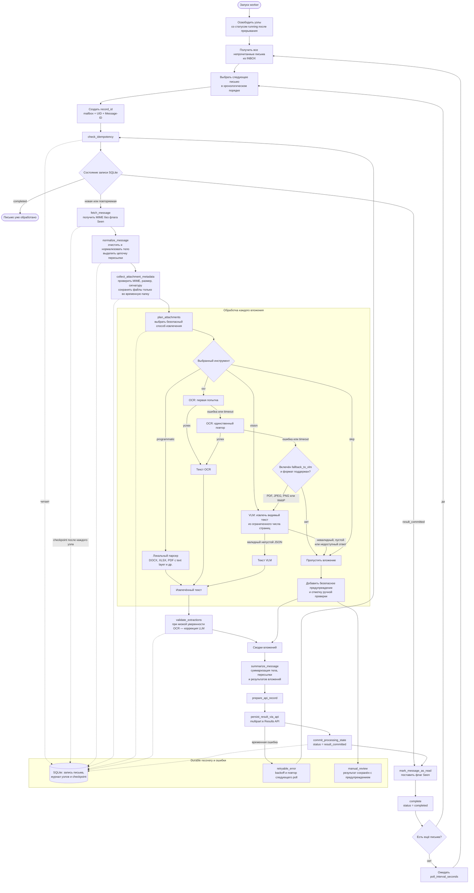

# Mail agent

`mail-agent` — worker Python 3.11+, который получает все непрочитанные письма Яндекс Почты, анализирует тело и вложения через OCR/LLM и сохраняет результат в независимый Results API. Яндекс Диск, Excel и Markdown-отчёты не участвуют в runtime.

Обычное тело письма длиннее `limits.message_body_chunk_size` (по умолчанию 3000
символов) анализируется последовательными фрагментами. В итоговый запрос попадают
только их компактные digest-сводки; это ограничивает размер одного LLM-запроса и
сохраняет факты из всего письма. Для очень длинного текста worker равномерно
выбирает максимум `limits.max_message_body_summary_chunks` фрагментов и добавляет
явное предупреждение в результат.

Для цепочки пересылки действует общий лимит
`limits.max_forwarded_summary_chunks` по всем уровням. Если лимит достигнут,
фрагменты выбираются равномерно, а в итог добавляется предупреждение. Вложения
обрабатываются последовательно; значение `limits.max_parallel_attachments`
намеренно допускает только `1`, чтобы временные файлы и checkpoint письма
оставались согласованными.

Дополнительно `llm.max_structured_requests_per_message` ограничивает суммарное
число логических LLM-операций для одного письма, включая выбор инструмента,
визуальное извлечение, коррекцию OCR и суммаризацию. Исчерпание лимита создаёт
результат для ручной проверки вместо неограниченного продолжения запросов.

## Поток



`record_id` зависит от mailbox, UID и Message-ID. Он служит ключом SQLite и HTTP idempotency key. `--reprocess` сохраняет тот же record ID и увеличивает `processing_generation`; API не разрешает старому generation перезаписать новое.

После API `committed` worker записывает SQLite status `result_committed` и минимальный checkpoint, затем ставит `\Seen`. Если процесс прерван между этими действиями, следующий запуск пропускает OCR/LLM и повторяет только установку флага. Старый SQLite status `table_committed` мигрируется в `discovered`: он не доказывает commit Results API.

После аварийной остановки новый запуск worker автоматически освобождает незавершённые узлы графа. Если результат действия уже успел попасть в checkpoint, он подтверждается без повторного обращения к OCR/LLM; иначе выполняется безопасная повторная попытка. Для этого не нужно удалять SQLite-базу.

## Классификация проекта

Итоговый анализ письма определяет одно основное направление и сохраняет его в
`agent_result.summary.classification`. Для решения используются тема, нормализованное
тело, все уровни пересылки, извлечённый текст и итоговые сводки вложений, а также
предупреждения о недоступных файлах. Содержимое письма и вложений остаётся
недоверенными данными и не может менять правила классификации.

Возможные коды: `3D_PRINTERS`, `CHEMISTRY`, `FOUNDRY`, `MOLD_PRINTING`,
`ROBOTIC_CELLS`, `PRODUCTION_LINES`, `MACHINES`, `TECHNICAL_VISION` и
`OTHER_EQUIPMENT`. Последний код используют только для явно промышленного
оборудования вне специализированных направлений, а не как запасной вариант для
неясного письма.

`classification.status` принимает одно из значений:

- `classified` — выбран ровно один код, русское название, причина и уверенность;
- `new_project` — ни одно направление семантически не подходит; `message_ru` всегда
  содержит точную фразу `Это новый проект`;
- `manual_review` — данных недостаточно из-за ошибки обработки, недоступного важного
  вложения или сбоя LLM. Это не является новым проектом.

Код, русское название, причина, уверенность и сообщение возвращаются только внутри
итоговой сводки; отдельное дублирование в payload не требуется.

## Конфигурация

```bash
cp agent/config.example.yaml agent/config.yaml
cp .env.infrastructure.example .env
cp yandex/mail/.env.example yandex/mail/.env
```

Корневой `.env` — единый файл для Docker Compose и worker. Worker безопасно
читает его как данные, без выполнения shell-кода: `WRITER_API_KEY` используется
для записи в Results API, а `RESULTS_API_HOST` и `RESULTS_API_PORT` определяют
его адрес. Не нужно отдельно экспортировать `RESULTS_API_KEY` или URL API.
Явно переданные переменные окружения имеют приоритет; альтернативный файл можно
указать через `AGENT_ENV_FILE`.

В `config.yaml` задаются резервные значения, timeout/retry/TLS. Пример:

```yaml
results_api:
  base_url: http://127.0.0.1:8080
  api_key: ""
  timeout_seconds: 300
  max_retries: 3
  verify_tls: true
```

`mail.unread_only: false` разрешает обход всех писем папки, а
`mail.mark_read_after_success: false` оставляет успешно обработанное письмо
непрочитанным. Повторной обработки при этом не происходит благодаря SQLite
idempotency state.

OCR выполняет не более двух HTTP-запросов к одному вложению: `ocr.max_retries: 1`
означает один повтор после первой попытки. Для PDF, JPEG, PNG и WebP после
исчерпания OCR автоматически используется VLM (`ocr.fallback_to_vlm: true`).
Если VLM не вернёт валидный непустой структурированный текст, вложение получает
статус `skipped`, а письмо продолжает обработку с отметкой о ручной проверке.

## Запуск

```bash
make infra-up
make install PROFILE=core
make auth-mail
make health PROFILE=core
make once
```

Команды ручного восстановления:

```bash
uv run --project agent mail-agent process --uid 123 --mailbox INBOX
uv run --project agent mail-agent process --uid 123 --mailbox INBOX --reprocess
uv run --project agent mail-agent retry-failed
uv run --project agent mail-agent dashboard
```

Панель на `127.0.0.1:8765` показывает `result_committed`, но не тело письма,
бинарные данные или ключи. Для открытия с другого устройства доверенной LAN
укажите в `config.yaml` private/VPN IP сервера, например:

```yaml
dashboard:
  host: 192.168.88.32
  port: 8765
```

Затем запустите `make dashboard` и ограничьте TCP/8765 firewall только нужной
подсетью. Публичные адреса и `0.0.0.0` намеренно запрещены. Полный contract и
ограничения интеграций приведены в [docs/public-contracts.md](docs/public-contracts.md).
